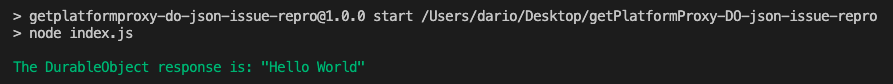
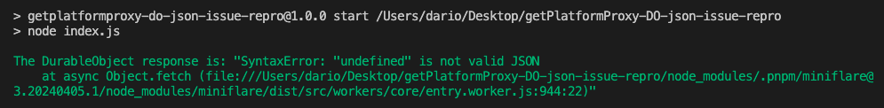

# `getPlatformProxy` DO JSON issue repro

Calling `getPlatformProxy` on wrangler <= v3.45.0 allows the interaction with Durable Object proxies
as expected, on wrangler >= v3.46.0 instead a `SyntaxError: "undefined" is not valid JSON` error is presented

# To reproduce the issue
Install the dependencies
```
pnpm i
```

Run
```
pnpm ok
```
To see the correct result:


Run
```
pnpm ko
```
To instead see the problematic result:

